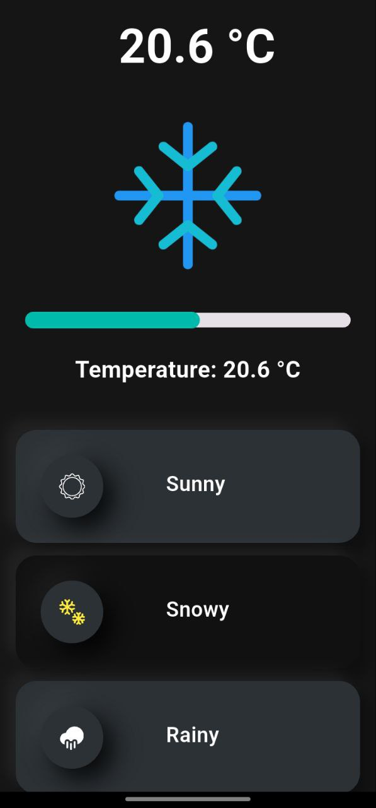
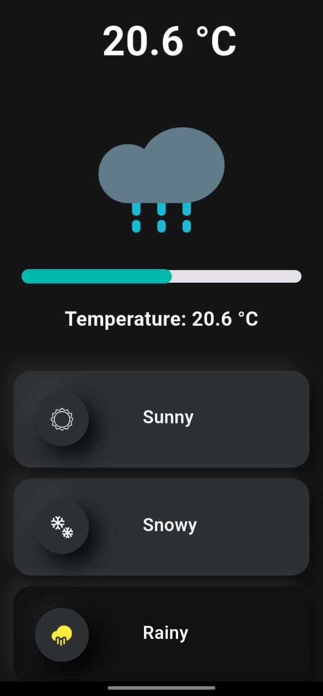
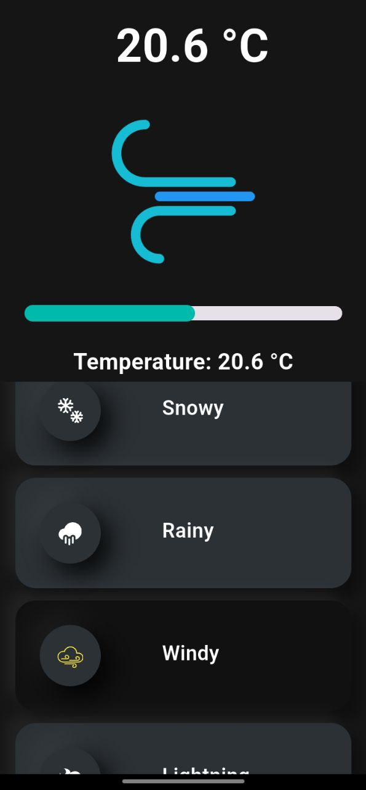
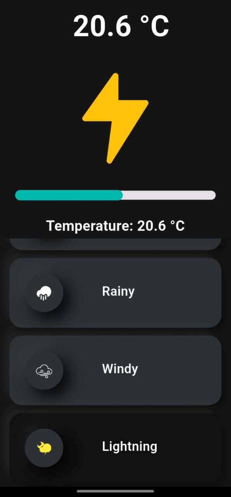
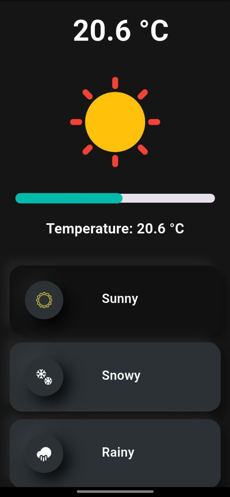

---

# Weather App

This is a Flutter application that displays weather conditions and allows users to adjust and view temperature values using custom widgets.

## Features

- Display weather conditions with custom icons and backgrounds
- Adjust and view temperature values using a custom slider
- Highlight selected weather conditions

## Screenshots

     


      


## Getting Started

To get a local copy up and running, follow these steps.

### Prerequisites

- Flutter SDK: [Install Flutter](https://flutter.dev/docs/get-started/install)

### Installation

1. Clone the repo:
   ```sh
   git clone https://github.com/teotia-codes/demo_app
   ```
2. Navigate to the project directory:
   ```sh
   cd demo_app
   ```
3. Install dependencies:
   ```sh
   flutter pub get
   ```
4. Run the app:
   ```sh
   flutter run
   ```

## Usage

### Home Screen

The home screen displays different weather conditions. You can select a weather condition by tapping on it, which will highlight the selected condition.

### Temperature Adjustment

Use the custom slider to adjust the temperature. The current temperature value will be displayed on the screen.

## Custom Widgets

### GridCard

`GridCard` is a custom widget that displays the temperature value. 

```dart
import 'package:flutter/material.dart';

class GridCard extends StatelessWidget {
  final double temperature;

  const GridCard({Key? key, required this.temperature}) : super(key: key);

  @override
  Widget build(BuildContext context) {
    return Padding(
      padding: const EdgeInsets.only(left: 4.0, bottom: 15),
      child: Container(
        width: 150,
        height: 100,
        padding: const EdgeInsets.all(15.0),
        child: Text(
          "${temperature.toStringAsFixed(1)} °C",
          textAlign: TextAlign.center,
          style: const TextStyle(
            color: Colors.white,
            fontWeight: FontWeight.bold,
            fontSize: 45,
          ),
        ),
      ),
    );
  }
}
```

### SliderWithLabel

`SliderWithLabel` is a custom slider widget used to adjust the temperature.

```dart
class SliderWithLabel extends StatefulWidget {
  const SliderWithLabel({super.key});

  @override
  State<SliderWithLabel> createState() => _SliderWithLabelState();
}

class _SliderWithLabelState extends State<SliderWithLabel> {
  double _currentValue = 30;

  @override
  Widget build(BuildContext context) {
    return Column(
      mainAxisAlignment: MainAxisAlignment.center,
      children: [
        SliderTheme(
          data: SliderTheme.of(context).copyWith(
              trackHeight: 14,
              activeTrackColor: const Color(0xFF00BAAB),
              thumbColor: Colors.transparent,
              thumbShape: const RoundSliderThumbShape(enabledThumbRadius: 0.0)),
          child: Slider(
            min: 0,
            max: 100,
            value: _currentValue,
            onChanged: (value) {
              setState(() {
                _currentValue = value;
              });
            },
          ),
        ),
        Row(
          children: [
            const Text('Label', style: TextStyle(fontWeight: FontWeight.bold)),
            const Spacer(),
            Text('${_currentValue.toInt()} %', style: const TextStyle(fontWeight: FontWeight.w500))
          ],
        )
      ],
    );
  }
}
```

## Contributing

Contributions are what make the open-source community such an amazing place to learn, inspire, and create. Any contributions you make are **greatly appreciated**.

1. Fork the Project
2. Create your Feature Branch (`git checkout -b feature/AmazingFeature`)
3. Commit your Changes (`git commit -m 'Add some AmazingFeature'`)
4. Push to the Branch (`git push origin feature/AmazingFeature`)
5. Open a Pull Request

## License

Distributed under the MIT License. See `LICENSE` for more information.

## Contact

Email -  priyanshu.teotia50@gmail.com

Project Link: [https://github.com/your-username/weather-app](https://github.com/your-username/weather-app)](https://github.com/teotia-codes/demo_app/tree/main)

---


